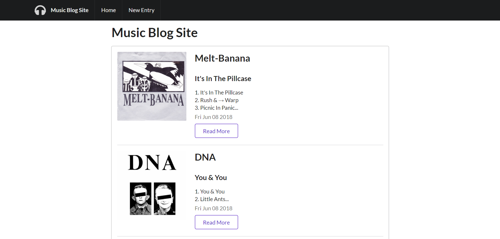
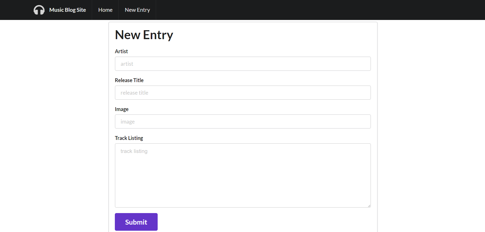

# Music-Blog

# Project Description

This blog is an Express app that allows you to enter album information on any band or artist. Create new entries by submitting an artist, album title, album artwork (image URL), and track listing. You can also edit and delete your entries.

This application uses Node.js and RESTful routes. All of the user's information persists using MongoDB as the database. Semantic UI is used for the design.

# Technologies Used

* Express.js
* Node.js
* AJAX/APIs
* jQuery
* JavaScript
* Bootstrap
* CSS
* HTML

# Music-Blog Live Link

Friend Finder is deployed to Heroku. Please check it out here:

https://tranquil-wildwood-64365.herokuapp.com/blogs

# Screenshots

